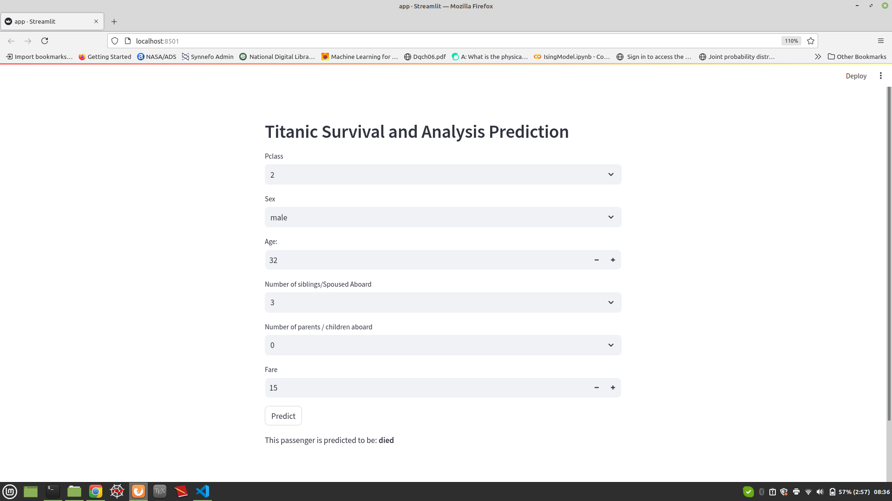

This project uses  to predict if a passenger survived or not. 

This data set contains both numerical and categorical features. Null values are also there. So, before proceeding for model building one needs to take care of all these. 

DecisionTreeClassifier has been used for this binary classification project. Hyperparameter Tuning has been performed to get the best parameters for prediction task. Then Streamlit has been used for deployment. 


### How to run ? 

- Download the whole package as zip. Unzip the package, i.e. 'TitanicSurvival.zip':
```
unzip TitanicSurvival.zip

```

- Go to the new folder (ie. the folder created after unzipping)
```
cd TitanicSurvival
```

- Create a local enviornment. I have used python version 3.8. One can use higher version too.
```
conda create -p venv python==3.8 -y
```

- Activate the new enviornment.
```
conda activate venv/
```

- Now make a file named 'requirements.txt'. Here we put all the required libraries with versions. To install required libraries, do -
```
pip install -r requirements.txt
```

- Now in 'notebooks' directory, there is a 'notebook.ipynb' file. Once we run this, this will generate 'preprocessor.pkl' and 'best_dt_clf.pkl'. 

- These above two pickle files are required for prediction purpose. 

- For deployment we are using 'Streamlit' library. The file 'app.py' helps to do so. To run 'app.py' - 
```
streamlit run app.py
```
This will open a browser at localhost where you will be able to get the recommendations.

Here one thing to be noticed that scikit-learn version used to generate the pickle files should be compatible with the scikit-learn version available for the particular streamlit version installed on system. Otherwise, it going to give error. 

Here is a glimpse of the output. 


**Prediction 1.**


**Prediction 2.**


### Online Deployment
Please find the [AppURL](https://titanicsurvival-mhy6chehcnkqezfphstv4x.streamlit.app/) on Streamlit space. 